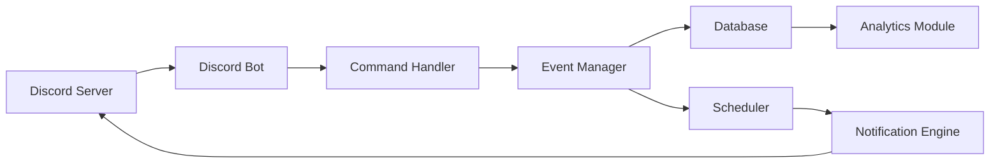

### System Design Document - SFL Advanced Event Notification Discord Bot for MMO Guilds
**Goal:** Increase guild event awareness/participation via automated reminders, RSVPs, role-based tracking, and timezone support.

---

#### **Core Features**  
1. **Event Creation & Management**  
   - Guild officers create events with:  
     - Title, description, datetime (start/end).  
     - Recurrence (daily/weekly), required roles (e.g., ""Healer,"" ""Tank"").  
     - Max attendees, RSVP deadlines.  
   - Commands: `/event create`, `/event edit`, `/event cancel`.

2. **Dynamic RSVP System**  
   - Members RSVP via reactions/buttons: `✅ Going`, `❌ Not Going`, `❓ Maybe`.  
   - Role-based slot tracking (e.g., ""2/4 Healers filled"").  
   - Auto-waitlist when event is full.

3. **Smart Notifications**  
   - Automated reminders:  
     - Scheduled (e.g., 24h, 1h before event).  
     - Custom triggers (e.g., when role slots are unfilled).  
   - Timezone-aware: Display times in each user’s local time.

4. **Event Discovery**  
   - Browse events via `/events list` (filter by date/status).  
   - Daily digest of upcoming events in a dedicated channel.  
   - Search: `/events find raid`.

5. **Analytics & Follow-ups**  
   - Post-event summary: Attendance, no-shows.  
   - Opt-in DM recaps for missed events.

---

#### **Architecture**  

##### **Components**  
1. **Command Handler**  
   - Processes slash commands (e.g., `/event create`).  
   - Validates permissions (officer-only for event creation).  
   - Uses Discord.js `InteractionCollector` for RSVP buttons.

2. **Event Manager**  
   - Core logic for CRUD operations on events.  
   - Handles recurrence (e.g., via `node-schedule` or `rrule`).  
   - Enforces RSVP deadlines/role quotas.

3. **Database**  
   - **Tables**:  
     - `Events`: ID, title, datetime, recurrence, roles, guild_id.  
     - `RSVPs`: event_id, user_id, status (Going/Not/Maybe), role.  
     - `Users`: user_id, timezone, notification_preferences.  
     - `Guilds`: guild_id, default_notification_channel.  
   - **DB Choice**: PostgreSQL (relational, handles recurrence well).

4. **Scheduler**  
   - Triggers reminders at predefined intervals.  
   - Uses **Redis BullMQ** for persistent, fault-tolerant job queues.  
   - Queues: `reminders`, `digests`, `follow-ups`.

5. **Notification Engine**  
   - Formats messages (e.g., embeds with role slots).  
   - Timezone conversion (via `luxon` or `moment-timezone`).  
   - Targets: Channels, role mentions, or DMs.

6. **Analytics Module**  
   - Generates post-event reports (e.g., ""Attendance: 12/15"").  
   - Tracks participation trends for guild officers.

---

#### **Workflow: Event Lifecycle**  
1. **Creation**  
   - Officer runs `/event create` → bot prompts for details.  
   - Event stored in DB; confirmation embed posted.  
   - Scheduler queues reminders.

2. **RSVP Period**  
   - Members click buttons to RSVP → DB updated.  
   - Embed dynamically updates role slots.  
   - Deadline passes → locks RSVPs.

3. **Pre-Event**  
   - Scheduled reminders:  
     - 24h before: General mention.  
     - 1h before: Urgent ping + role gap alerts (e.g., ""Need 1 Tank!"").  

4. **Post-Event**  
   - Analytics: Auto-post attendance summary.  
   - Recurrence: Next event generated (if applicable).

---

#### **Scalability & Reliability**  
- **Sharding**: Discord.js sharding for large guilds.  
- **Concurrency**:  
  - Async/await for I/O operations (DB, Discord API).  
  - Rate limit handling (e.g., `@discordjs/rest`).  
- **Fail-safes**:  
  - Redis job persistence (prevents reminder loss on bot restart).  
  - Idempotent commands (e.g., retry-safe event edits).  

---

#### **Security & Compliance**  
- **Data Privacy**:  
  - Store only necessary data (e.g., user IDs, not messages).  
  - GDPR-compliant deletion via `/opt-out`.  
- **Permissions**:  
  - Role-based access (e.g., `MANAGE_EVENTS` role for officers).  
  - Channel lockdown (e.g., bot-only events channel).

---

#### **Tech Stack**  
- **Language**: TypeScript (strict typing for safety).  
- **Libraries**:  
  - Discord.js (v14+) + Discord API v10.  
  - PostgreSQL + TypeORM/Prisma.  
  - BullMQ (Redis), Luxon (timezones).  
- **Infrastructure**:  
  - Docker containerization.  
  - Stateless design (easy horizontal scaling).

---

#### **Next Steps**  
1. Finalize DB schema (e.g., ER diagram).  
2. Define RESTful endpoints for internal modules.  
3. Draft key Discord UI elements (embeds/buttons).  
4. Plan test cases (e.g., timezone edge cases, role conflicts).  
