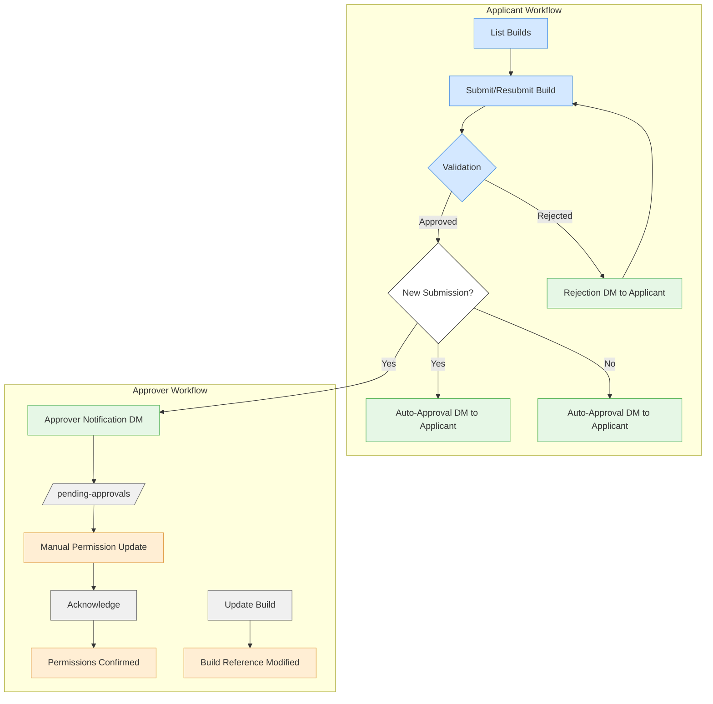

# Architecture Design Document - SFL Approved Builds Verification Bot

## Project Goal
Build a TypeScript Discord bot to manage guild event build approvals with:
- Dual user roles (Applicants & Approvers)
- Automated screenshot validation with item/IP verification
- In-game name matching via OCR
- Dynamic build configuration management

## Core Requirements

### User Types
**Applicants:**
- Submit builds via screenshots
- Check approval status
- Resubmit after rejection

**Approvers:**
- Manage approval records
- Update build references
- Acknowledge permission updates

### Technical Requirements
- Automated screenshot validation (ignoring border variations)
- IP value verification (Item Power)
- Per-server username confirmation via OCR
- Manual approver acknowledgment system
- Dynamic build configuration updates

## Workflow Summary

### Applicant Workflow
1. `/build-review list` - View approved builds
2. `/build-review submit build_id:<id>` - Submit or resubmit build by attaching a PNG screenshot
   - New submissions: Creates new record
   - Resubmissions: Updates existing rejected submission
3. Receive one of two DM notifications:
   - **Auto-Approval DM**: Build is approved and pending approver acknowledgement
   - **Rejection DM**: Build rejected with specific reasons and resubmission instructions

### Approver Workflow
1. **New Approval DM**: Receive notification only for first-time auto-approved builds
2. `/build-review pending-approvals` - View completed approvals needing acknowledgment
3. Update user permissions manually
4. `/build-review acknowledge submission_id:<id>` - Confirm permissions updated
   - **Submission ID Source**: 
     - Displayed in `/build-review pending-approvals` command output
     - Included in approver notification DMs
     - Shown in guild audit logs
   - **Workflow**:
     1. Run `/build-review pending-approvals` to list submissions needing acknowledgment
     2. Copy submission ID from the list
     3. Use in acknowledge command
5. `/build-review update build_id:<id>` - Modify reference builds
   - **Screenshot Update**: Attach new PNG screenshot (same validation as submission)
   - **Build Requirements**: Edit via modal form with:
     - Item names
     - IP ranges
     - Position coordinates
     - Description
   - **Workflow**:
     1. Command triggers a modal form
     2. Pre-filled with current build data
     3. Approver edits fields as needed
     4. Submit updates configuration

### Notification Behavior
- **First-time approvals**:
  - Trigger Applicant Auto-Approval DM
  - Trigger Approver Notification DM
- **Resubmission approvals**:
  - Trigger Applicant Auto-Approval DM
  - ❌ Do NOT trigger new Approver Notification DM
- **Rejections**:
  - Trigger Applicant Rejection DM
  - ❌ Do NOT trigger Approver Notification

## Workflow Visualization



## Technical Implementation

### Key Technologies
- Discord.js: Bot framework
- SQLite: Build/submission storage
- Jimp: Image processing
- Tesseract.js: OCR for username/IP extraction
- TensorFlow.js: Image similarity comparison (optional)

### Attachment Handling Implementation
**Command Structure:**
```typescript
// In command registration
.addStringOption(option => 
    option.setName('build_id')
        .setDescription('Build ID to submit')
        .setRequired(true)
)
.addAttachmentOption(option => 
    option.setName('screenshot')
        .setDescription('PNG screenshot of your build')
        .setRequired(true)
)
```

**Validation Logic:**
```typescript
// In command handler
const attachment = interaction.options.getAttachment('screenshot');

// Validate file type
if (!attachment.contentType?.startsWith('image/png')) {
    return interaction.reply({
        content: 'ERROR: Please attach a PNG image',
        ephemeral: true
    });
}

// Validate file size (max 8MB)
if (attachment.size > 8 * 1024 * 1024) {
    return interaction.reply({
        content: 'ERROR: File size exceeds 8MB limit',
        ephemeral: true
    });
}
```

**Processing Flow:**
```typescript
// Download and process image
const response = await fetch(attachment.url);
const arrayBuffer = await response.arrayBuffer();
const buffer = Buffer.from(arrayBuffer);

// Process with Jimp
const image = await Jimp.read(buffer);
image.grayscale().normalize();  // Preprocessing for OCR

// Validate build
const validation = await validateBuild(image, buildId, interaction.user.id);
```

**Security Considerations:**
- All image processing occurs in memory (no disk writes)
- Files are validated before processing
- OCR input is sanitized to prevent injection attacks
- Rate limiting applied to prevent abuse
- Ephemeral responses used for sensitive feedback

### Configuration Schema
```json
{
  "builds": [
    {
      "id": 101,
      "description": "Tank Build - Frost Staff + Ice Heart",
      "screenshot": "https://imgur.com/tank_build.png",
      "items": [
        {
          "name": "Frost Staff",
          "ipRange": [1200, 1500],
          "position": {
            "x": 100,
            "y": 200,
            "width": 50,
            "height": 50
          }
        }
      ]
    }
  ]
}
```

### Critical Components
**Screenshot Validation:**
```typescript
async function validateScreenshot(userImageUrl, buildId, username) {
  // 1. Verify username match via OCR
  // 2. Extract IP value
  // 3. Validate items focusing on center area
  // 4. Return { approved, missingItems }
}
```

**Build Update Command:**
```typescript
export async function handleUpdateBuild(interaction) {
  const attachment = interaction.options.getAttachment('new_screenshot');
  const newItems = await detectItems(attachment.url);
  updateBuildConfig(buildId, {
    screenshot: attachment.url,
    items: newItems
  });
}
```

**OCR Service:**
```typescript
export async function ocrScan(image) {
  const worker = await createWorker('eng');
  const { data } = await worker.recognize(image);
  return data.text;
}
```

### Project Structure
```
/src
├── bot
│   ├── commands.ts   # Slash command handlers
│   └── events.ts     # Button/modal handlers
├── core
│   ├── validation.ts # Image/IP/username checks
│   └── ocr.ts        # Text extraction
├── config
│   ├── manager.ts    # Build configuration loader
│   └── schemas.ts    # Type definitions
├── database          # Submission storage
└── utilities         # Helper functions
```

## Next Development Steps
1. Implement OCR integration for username/IP extraction
2. Develop item position detection algorithm
3. Build border-tolerant image comparison
4. Create DM notification pipelines
5. Add role-based permission system
6. Implement audit logging

## Security Considerations
- Validate all image URLs
- Sanitize OCR input/output
- Implement size limits for uploads
- Add role-based command permissions
- Prevent permission escalation

## Dependencies Required
```bash
npm install discord.js better-sqlite3 jimp tesseract.js
npm install -D @types/jimp @tensorflow/tfjs-node
```

> This document contains all architectural decisions, technical specifications, and workflow details discussed. You can directly copy this context to continue development in another environment.
