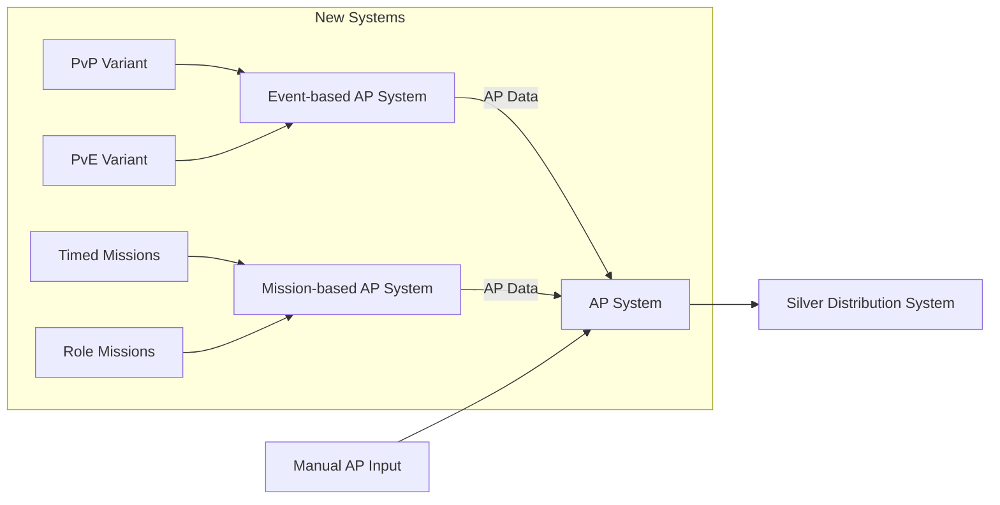

# Guild AP System Proposal - Option A

## Core Systems (Existing)
### `AP System`
- **Role**: Central ledger for all AP (manual + automated)
- **Key Features**:
  - Manual AP entries by officers (overrides/exceptional cases)
  - AP reconciliation (fixes for errors from automated systems)
  - Non-event AP tracking (social contributions, etc.)

### `Silver Distribution System`
- Unchanged; pulls final AP totals weekly

## New Base Systems
### `Event-based AP System` *(Base)*
- **Expansion**: Framework for event-type variants:
  - *PvP Events*: AP rules for ZvZs, GvGs
  - *PvE Events*: AP scaling for dungeons/HCEs
  - *Social Events*: AP for community activities

### `Mission-based AP System` *(Base)*
- **Expansion**: Framework for mission-type variants:
  - *Timed Missions*: Urgency bonuses
  - *Role Missions*: Tank/healer-specific rewards
  - *Resource Missions*: Gathering quotas

## Integration Flow

## Key Features
- **Scalability**: Variants can be added/removed without disrupting core
- **Consistency**: All paths funnel through `AP System`
- **Officer Control**: Manual adjustments remain centralized
