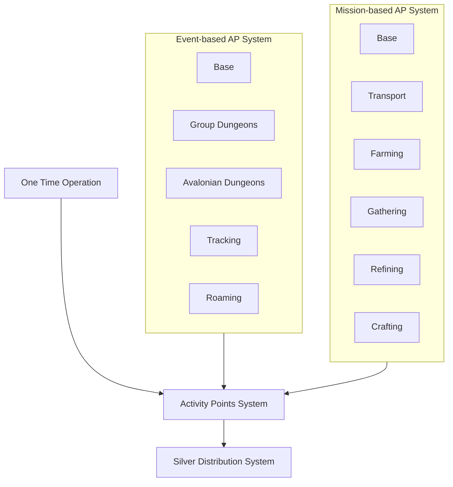

# New Point System Proposal - Option A

## Core Systems (Existing)
### `Activity Points System`
- **Role**: Central ledger for all AP (manual + automated)
- **Key Features**:
  - Manual AP entries by admin (overrides/exceptional cases)
  - AP reconciliation (fixes for errors from automated systems)
  - Non-event and Non-mission AP tracking (guild meetings, etc.)

### `Silver Distribution System`
- Unchanged; pulls final AP totals weekly

## New Base Systems
### `Event-based AP System` *(Base)*
- **Expansion**: Framework for event-type variants:
  - *Group Dungeons Events*: AP for group dungeons
  - *Avalonian Dungeons Events*: AP for avalonian dungeons
  - *Tracking Events*: AP for tracking activities
  - *Roaming Events*: AP for roaming activities

### `Mission-based AP System` *(Base)*
- **Expansion**: Framework for mission-type variants:
  - *Transport Missions*: AP for transport activities
  - *Farming Missions*: AP for farming activities
  - *Gathering Missions*: AP for gathering activities
  - *Refining Missions*: AP for refining activities
  - *Crafting Missions*: AP for crafting activities

## Integration Flow

## Key Features
- **Scalability**: Variants can be added/removed without disrupting core
- **Consistency**: All paths funnel through `Activity Points System`
- **Admin Control**: Manual adjustments remain centralized
