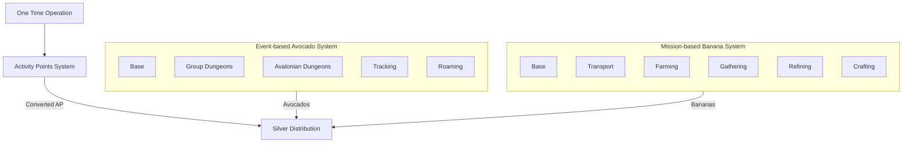

# New Point System Proposal - Option B (Silver-Centric)

## Core Systems (Existing)
### `Activity Points System`
- **Role**: Manual AP tracking only (non-event/mission activities)
- **Key Changes**:
  - No longer receives automated AP
  - Converts manual AP → Silver (fixed rate)

### `Silver Distribution System`
- **New Role**: Aggregates Avocados + Bananas + Converted AP

## New Currency Systems
### `Event-based Avocado System` *(Replaces Event-based AP)*
- **Output**: Avocados (converted to Silver)
- **Variants (from Option A)**:
  - *Group Dungeons Events* → Avocados
  - *Avalonian Dungeons Events* → Avocados  
  - *Tracking Events* → Avocados
  - *Roaming Events* → Avocados

### `Mission-based Banana System` *(Replaces Mission-based AP)*
- **Output**: Bananas (converted to Silver)
- **Variants (from Option A)**:
  - *Transport Missions* → Bananas
  - *Farming Missions* → Bananas
  - *Gathering Missions* → Bananas
  - *Refining Missions* → Bananas  
  - *Crafting Missions* → Bananas

## Integration Flow

## Key Differences from Option A
- **Currency Conversion**: 
  - Events → Avocados → Silver
  - Missions → Bananas → Silver
  - Manual AP → Silver
- **AP System**: Now handles **only** manual inputs
- **Silver**: Unified payout currency
