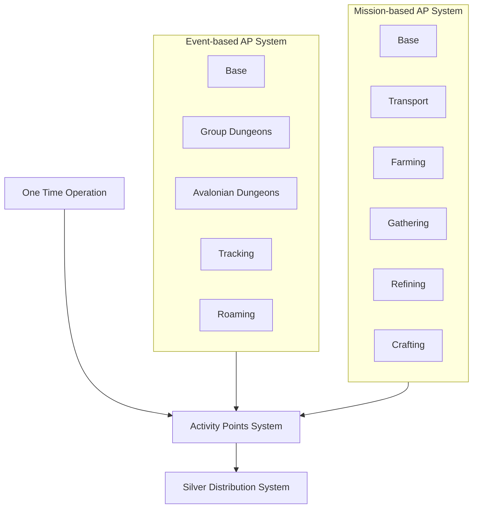

# New Point System Proposal - Option A (AP-Centric with New Currency Systems)

## Core Systems (Existing)
### `Activity Points System`
- **Role**: Central ledger for all AP (manual + automated)
- **Key Features**:
  - Manual AP entries by admin (overrides/exceptional cases)
  - AP reconciliation (fixes for errors from automated systems)
  - Non-event and Non-mission AP tracking (guild meetings, etc.)

### `Silver Distribution System`
- Unchanged; pulls final AP totals weekly

## New Currency Systems
### `Event-based Avocado System` *(Replaces Event-based AP Sytem)*
- **Output**: Converted Avocados in AP
- **Variants (from Option A)**:
  - *Group Dungeons Events* → Avocados
  - *Avalonian Dungeons Events* → Avocados  
  - *Tracking Events* → Avocados
  - *Roaming Events* → Avocados

### `Mission-based Banana System` *(Replaces Mission-based AP System)*
- **Output**: Converted Bananas in AP
- **Variants (from Option A)**:
  - *Transport Missions* → Bananas
  - *Farming Missions* → Bananas
  - *Gathering Missions* → Bananas
  - *Refining Missions* → Bananas  
  - *Crafting Missions* → Bananas

## Integration Flow

## Key Features
- **Scalability**: Variants can be added/removed without disrupting core
- **Consistency**: All paths funnel through `Activity Points System`
- **Admin Control**: Manual adjustments remain centralized
